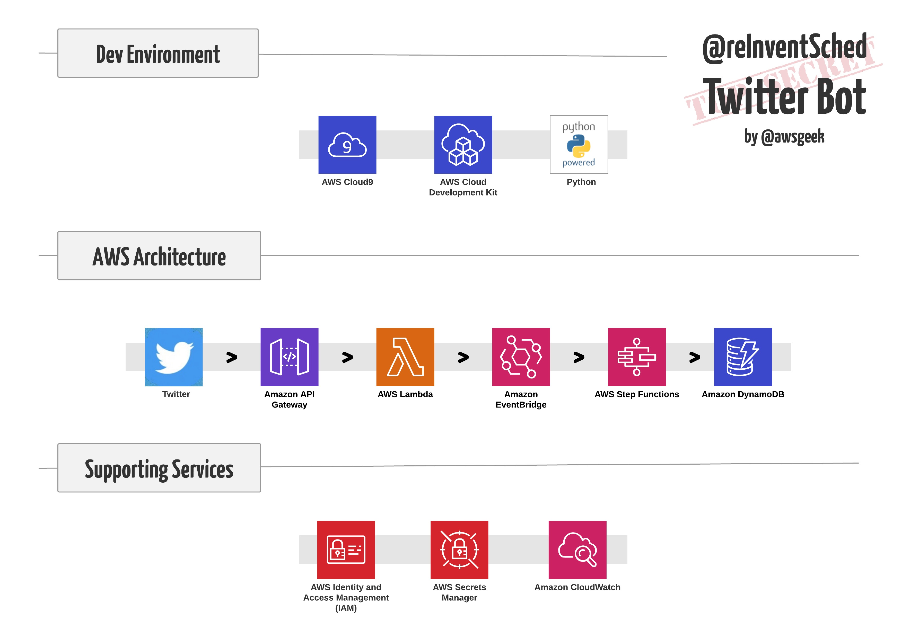
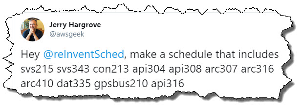
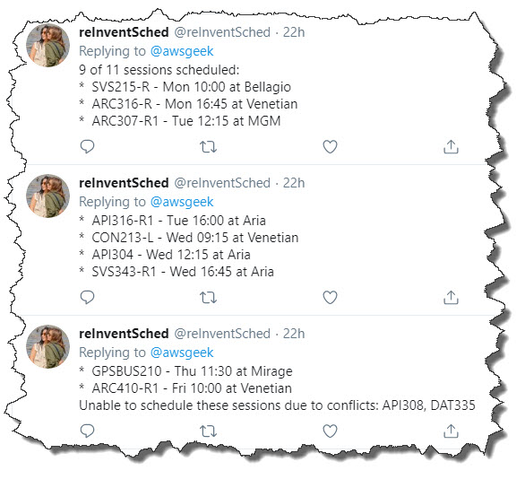

### AWS Architecture ###
### Twitter ####
Twitter is the public interface to this service. Users interact with the service by tweeting reInvent schedule requests that include session codes they'd like to attend. For example:



#### Amazon API Gateway ####
API Gateway acts as the public facing endpoint for the service. Twittter sends CRC validation requests to this endpoint (GET) and forwards subscription events to this endpoint (POST). Thes subscription events are tweets, specifically, mentions of @reInventDemo. 

#### AWS Lambda #### 
Lambda is used for all executable code for the service. This includes code associated with the Twitter webhook (CRC validation & request parsing) and schedule generation (parse requests, scrape web pages, and generate schedules). All Lambda functions are writting on Python.

#### Amazon EventBridge #### 
EventBridge is used as an event bus that delivers Twitter requests to the service. The Lambda function ahndling Twitter requests publishes the associated Tweet as an event on EventBus. A correspoding rule filters these specific events and triggers A Step FUnctions machine to process each event. 

####  AWS Step Functions #### 
Step Functions is used to oechestrate execution of Lambda functions that parse requests, scrape web pages, and generate schedules in response to user reuquests. 



#### Amazon DynamoDB #### 
DynamoDB acts as a temporary cache for session information that has been scraped from the reInvent web site. 

### Supporting Services ###
#### AWS IAM (Identiy & Access Management) #### 
IAM is used to ensure security best practices and least priviledges are utilized throughout the service

#### AWS Secrets Manager #### 
Secrets Manager is used to securely manage the set of Twitter credentials that used by several Lambda functions in the service to interact with the Twitter API. 

#### Amazon CloudWatch #### 
CloudWatch is used to monitor service events and to access service logs, particularly those from Lambda functions, when debugging, 

### Dev Environment ###
#### AWS Cloud 9 #### 
Cloud 9 is the IDE used for authoring code used in Lambda functions and for CDK stack defintion. 

#### AWS CDK #### 
The AWS CDK is used to manage and deploy the AWS infrastructure associated with the service. 

#### Python #### 
Python is the language of choice and used for both the AWS CDK and Lambda function implementation


```
$ source .env/bin/activate
$ pip install -r requirements.txt
$ export TWITTER_SECRET_ARN=<secretsmanager arn>
$ cdk deploy
```
